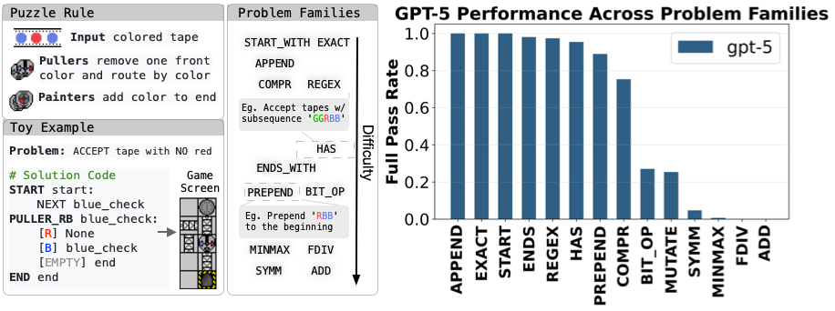

# Manufactoria

A challenging programming benchmark based on the classic [Manufactoria Flash game (2010)](http://pleasingfungus.com/Manufactoria/), designed for studying learnability and reinforcement learning with verification rewards.

## Table of Contents
- [Introduction](#introduction)
- [Key Features](#key-features)
- [Installation](#installation)
- [Problem Types](#problem-types)
- [Quick Usage: Loading from Hugging Face](#quick-usage-loading-from-hugging-face)
- [Quick Start: Problem Generation](#quick-start-problem-generation)
- [Visualization Dashboard](#visualization-dashboard)
- [Verification Server](#verification-server)
- [Using with RLVR (Reinforcement Learning with Verification Rewards)](#using-with-rlvr)
- [Project Structure](#project-structure)
- [DSL Syntax](#dsl-syntax)
- [License](#license)

## Introduction

Manufactoria is a puzzle game where you program "robot factories" to process colored tape sequences. Robots enter carrying a tape of colored symbols, and your factory must read, write, and route them based on specific criteria.

We've transformed this concept into a **clean, text-based DSL** (Domain Specific Language) that's perfect for:
- Testing language models' reasoning and programming abilities
- Reinforcement learning with verifiable rewards
- Curriculum learning and difficulty scaling



**Challenging Complexity**: Problems range from trivial pattern matching to computational tasks so difficult that even state-of-the-art LLMs like GPT-5 struggle with 0% success rates on the hardest variants.

**Clean Abstraction**: Instead of a 2D puzzle grid, we provide a minimal programming language with just **two primitive operations**:
- **PULLER**: Reads and removes a symbol from the front of the tape
- **PAINTER**: Writes and appends a symbol to the end of the tape

Think of it as a **constrained Turing machine** where:
- Input is read left-to-right, always from the front
- Output is written right-to-left, always to the back
- The machine routes through a finite state graph

## Key Features

- **🎯 10+ Problem Families**: From basic sequence matching to complex numerical operations
- **📊 4 Difficulty Levels**: Basic, Easy, Medium, Hard
- **🎨 Color Modes**: Two-color (R/B) and four-color (R/B/Y/G) variants
- **🔄 Automatic Generation**: Parameterized generators for infinite problem variations
- **✅ Built-in Verification**: Fast execution engine with correctness checking
- **📱 Web Dashboard**: Visual interface for browsing and editing problems
- **🔧 YAML Configuration**: Flexible ensemble creation and difficulty tuning

## Installation

### Prerequisites

- Python 3.9+
- pip

### Setup

```bash
# Clone the repository
git clone <repository-url>
cd rl-grok-recipe/manufactoria

# Install dependencies
pip install -r requirements.txt
```

## Problem Types

We support **10+ different problem families**:

### Basic Pattern Matching
- `starts_with` - Check if tape starts with a pattern
- `ends_with` - Check if tape ends with a pattern
- `exact_sequence` - Match exact tape sequences
- `contains_substring` - Find substrings in tape
- `contains_ordered` - Check ordered symbol occurrences
- `contains_count` - Count symbol occurrences

### Sequence Manipulation
- `append_sequence` - Add patterns to tape end
- `prepend_sequence` - Add patterns to tape start

### Numerical Operations
- `numerical_operations` - Arithmetic (add, sub, mul, div) and bitwise operations
- `numerical_comparison` - Compare two numbers (>, <, ==, >=, <=)
- `numerical_max_min` - Find maximum or minimum

### Advanced Patterns
- `regex_pattern` - Regular expression matching
- `regex_same_num` - Equal counts of different symbols

Each problem family can be generated at multiple difficulty levels with different parameter configurations.

## Quick Usage: Loading from Hugging Face

We provide **10+ pre-generated datasets** on Hugging Face for immediate use. You can load them directly without generating problems locally.

### Available Datasets

All datasets are available at [https://huggingface.co/manufactoria/datasets](https://huggingface.co/manufactoria/datasets)

**Training/Test Pairs:**
- `manufactoria/basic_mix_train` / `manufactoria/basic_mix_test` - Mixed basic problems (348 train, 27 test)
- `manufactoria/has_train` / `manufactoria/has_test` - "Contains" patterns (742 train, 132 test)
- `manufactoria/regex_train` / `manufactoria/regex_test` - Regex matching (561 train, 99 test)
- `manufactoria/compr_train` / `manufactoria/compr_test` - Comparison operations (535 train, 95 test)
- `manufactoria/ends_train` / `manufactoria/ends_test` - "Ends with" patterns (107 train, 19 test)
- `manufactoria/prepend_sequence_train` / `manufactoria/prepend_sequence_test` - Prepend operations (612 train, 108 test)
- `manufactoria/minmax_train` / `manufactoria/minmax_test` - Max/min operations (501 train, 11 test)

**Test-Only Datasets:**
- `manufactoria/add_test` - Addition operations (14 problems)
- `manufactoria/fdiv_test` - Division operations (7 problems)
- `manufactoria/bit_op_test` - Bitwise operations (21 problems)
- `manufactoria/symm_test` - Symmetry patterns (100 problems)

### Python Usage

#### Load a Single Dataset

```python
from datasets import load_dataset

# Load training set
dataset = load_dataset("manufactoria/basic_mix_train")

# Access the data
for example in dataset['train']:
    print(f"Problem: {example['name']}")
    print(f"Description: {example['description']}")
    print(f"Test cases: {len(example['test_cases'])}")
    print(f"Difficulty: {example['difficulty_level']}")
    print()
```

## Quick Start: Problem Generation

### Full Pipeline

Run the complete generation pipeline:

```bash
bash run_generation.sh
```

This script executes three main steps:

### Step 1: Generate Difficulty-Level Problems

```bash
python problem_difficulty_generator.py
```

**What it does**: Creates individual problem files organized by pattern type, color mode, and difficulty level.

**Output**: Files in `problems/difficulty/` like:
- `numerical_operations_two_color_easy.jsonl`
- `contains_substring_four_color_medium.jsonl`
- `regex_pattern_four_color_hard.jsonl`

**Configuration**: Controlled via `configs/manufactoria_config.yaml` (if exists), which specifies:
- Which problem families to generate
- Difficulty parameters for each level
- Number of problems per difficulty
- Color modes to use

### Step 2: Create Problem Ensembles

```bash
python ensemble_generator.py --config configs/basic_mix.yaml
python ensemble_generator.py --config configs/compr.yaml
python ensemble_generator.py --config configs/ends.yaml
# ... etc for each config
```

**What it does**: Combines multiple problem families into mixed datasets for training/testing.

**Output**: Files in `problems/ensembles/` like:
- `basic_mix_train.jsonl` (training set)
- `basic_mix_test.jsonl` (test set)
- `basic_mix_metadata.json` (configuration metadata)


### Step 3: Wrap for Hugging Face

```bash
python hf_file_wrapper.py --input problems/ensembles/ --output problems/wrapped/ --upload false
```

**What it does**: Converts JSONL files to Hugging Face dataset format with proper metadata.

**Output**: JSON files in `problems/wrapped/` like:
- `manufactoria_basic_mix_train.json`
- `manufactoria_basic_mix_test.json`


## Visualization Dashboard

We provide a Flask-based web dashboard for browsing, editing, and testing problems.

### Launch the Dashboard

```bash
cd dashboard
python app.py
```

Then open your browser to `http://localhost:8080`

### Features

1. **Browse Problems**: 
   - Filter by problem type and color mode
   - Paginated view of all problems
   - Quick preview of test cases

2. **View/Edit Problems**:
   - Inspect problem descriptions and test cases
   - Edit problem parameters
   - Add or remove test cases
   - Validate DSL syntax in real-time

3. **Test Solutions**:
   - Write and test DSL solutions interactively
   - See execution traces for each test case
   - Get immediate feedback on correctness

4. **Create New Problems**:
   - Design custom problems from scratch
   - Define custom test cases
   - Auto-save to appropriate difficulty files

The dashboard automatically organizes problems by `{problem_type}_{color_mode}_{difficulty_level}.jsonl` files in `problems/difficulty/`.

## Verification Server

For large-scale evaluation and RLVR training, we provide a FastAPI-based verification server.

### Launch the Server

```bash
cd verifier
uvicorn manufactoria_api:app --host 0.0.0.0 --port 1235 &
```


### API Endpoints

#### Health Check

```bash
curl -X GET http://localhost:1235/health
```

#### Test Solution

```bash
curl -X POST http://localhost:1235/test_solution \
  -H "Content-Type: application/json" \
  -d '{
    "dsl": "START start:\n    NEXT end\nEND end", 
    "test_cases": [{"input": "", "expected_output": "", "expected_accepted": true, "check_output": false}],
    "max_execution_time": 1.0
}'
```

## Using with RLVR

Manufactoria is designed for **Reinforcement Learning with Verification Rewards** (RLVR), where models learn from sparse binary feedback (correct/incorrect) rather than supervised learning.

### Training Code

We provide complete training infrastructure in the companion repository:

**Repository**: [open-instruct/merge-code-utils](https://github.com/sunyiyou/open-instruct/tree/merge-code-utils)

### Setup Verification Infrastructure

#### 1. Deploy Verification Nodes

For distributed training, deploy multiple verification servers behind an nginx load balancer:

```bash
# Script to setup 40 verification nodes with nginx
bash configs/beaker_configs/manufactoria_api_setup.sh
```

#### 2. Integrate with Training Loop

The training code uses a `ManufactoriaVerifier` class to interface with the verification servers:

**Implementation**: [ground_truth_utils.py#L828](https://github.com/sunyiyou/open-instruct/blob/merge-code-utils/open_instruct/ground_truth_utils.py#L828)

Key features:
- **Per-test accuracy**: Percentage of test cases passed
- **Full-pass rate**: Binary success (all tests must pass)
- **Batched verification**: Process multiple solutions in parallel
- **Timeout handling**: Graceful handling of infinite loops
- **Retry logic**: Automatic retries on server failures

## Project Structure

```
manufactoria/
├── configs/                          # Ensemble configurations
│   ├── add.yaml
│   ├── basic_mix.yaml
│   ├── bit_op.yaml
│   └── ...
├── dashboard/                        # Web visualization interface
│   ├── app.py                        # Flask server
│   ├── templates/                    # HTML templates
│   └── static/                       # CSS/JS assets
├── manufactoria_problem_generators/  # Problem generators
│   ├── base.py                       # Base generator class
│   ├── numerical_operations.py
│   ├── contains_substring.py
│   └── ...
├── problems/                         # Generated problems
│   ├── difficulty/                   # Individual problems by difficulty
│   ├── ensembles/                    # Mixed problem sets
│   └── wrapped/                      # Hugging Face format
├── utils/                            # Utility functions
│   └── manufactoria_parser.py        # DSL parser
├── verifier/                         # Verification server
│   ├── manufactoria_api.py           # FastAPI server
│   └── manufactoria_parser.py        # Parser for verification
├── dsl.md                            # DSL documentation
├── problem_difficulty_generator.py   # Main generator script
├── ensemble_generator.py             # Ensemble creator
├── hf_file_wrapper.py               # Hugging Face wrapper
├── run_generation.sh                # Full pipeline script
└── requirements.txt                 # Python dependencies
```

## DSL Syntax

### Basic Structure

Every solution starts with `START` and ends with `END`:

```
START start:
    NEXT next_node

# Your factory logic here

END end
```

### Node Types

#### PULLER Nodes (Read & Route)

**Red/Blue Puller:**
```
PULLER_RB node_id:
    [R] next_if_red      # If front is Red, remove it and go here
    [B] next_if_blue     # If front is Blue, remove it and go here
    [EMPTY] next_if_empty  # If empty or wrong color, go here
```

**Yellow/Green Puller:**
```
PULLER_YG node_id:
    [Y] next_if_yellow
    [G] next_if_green
    [EMPTY] next_if_empty
```

#### PAINTER Nodes (Write & Continue)

```
PAINTER_RED node_id:
    NEXT next_node  # Append 'R' to end of tape

PAINTER_BLUE node_id:
    NEXT next_node  # Append 'B' to end of tape

PAINTER_YELLOW node_id:
    NEXT next_node  # Append 'Y' to end of tape

PAINTER_GREEN node_id:
    NEXT next_node  # Append 'G' to end of tape
```

### Example: Reverse Red/Blue Tape

```
START start:
    NEXT puller

PULLER_RB puller:
    [R] paint_red
    [B] paint_blue
    [EMPTY] end

PAINTER_RED paint_red:
    NEXT puller

PAINTER_BLUE paint_blue:
    NEXT puller

END end
```

For complete DSL documentation, see [`dsl.md`](dsl.md).


## Contributor

- **Yiyou Sun** 


